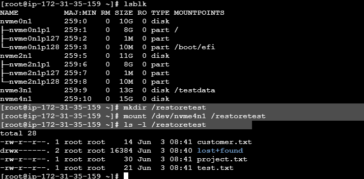

# AWS Automated Backup and Disaster Recovery System

## Project Overview

This project demonstrates how to implement backup and disaster recovery using Amazon EBS Snapshots.

The project creates an EBS volume, stores data, creates a snapshot backup, simulates data loss, restores a new volume from the snapshot, and verifies successful recovery.

---

## Services Used

* Amazon EC2
* Amazon EBS
* Amazon EBS Snapshots
* Amazon S3
* AWS CLI
* IAM
* Linux (Amazon Linux)

---

## Architecture

EC2 Instance

↓

EBS Volume

↓

Store Data

↓

Create Snapshot

↓

Delete Data (Simulation)

↓

Restore Volume From Snapshot

↓

Attach to EC2

↓

Recover Data

---

## Project Steps

### Step 1: Launch EC2 Instance

Created an Amazon Linux EC2 instance.


### Step 2: Create EBS Volume

Created a 13 GB gp3 EBS volume.

### Step 3: Attach EBS Volume

Attached the volume to the EC2 instance.

### Step 4: Format and Mount Volume

Commands used:

```bash
mkfs.ext4 /dev/nvme3n1

mkdir /testdata

mount /dev/nvme3n1 /testdata
```

### Step 5: Create Test Data

```bash
echo "Backup Test by Viren" > /testdata/test.txt

echo "Customer Data" > /testdata/customer.txt

echo "AWS Disaster Recovery Project" > /testdata/project.txt
```

### Step 6: Create Snapshot

Created a snapshot of the EBS volume using AWS Console.

### Step 7: Simulate Data Loss

Deleted the files:

```bash
rm -f /testdata/*
```

Verified that files were removed.

### Step 8: Restore Volume From Snapshot

Created a new EBS volume from the snapshot.

Attached the restored volume to the EC2 instance.

### Step 9: Mount Restored Volume

```bash
mkdir /restoretest

mount /dev/nvme4n1 /restoretest
```

### Step 10: Verify Recovery

Verified recovered files:

```bash
ls -l /restoretest
```


Recovered Files:

* customer.txt
* project.txt
* test.txt

This confirmed successful backup and recovery.

---

## Disaster Recovery Validation

Test Scenario:

1. Created files on EBS volume.
2. Created snapshot backup.
3. Deleted original files.
4. Restored volume from snapshot.
5. Mounted restored volume.
6. Verified recovered files.

Result:

Backup and Disaster Recovery process successfully validated.

---

## Learning Outcomes

* Amazon EBS Management
* Snapshot Backup Strategy
* Disaster Recovery
* Storage Management
* Linux Filesystem Management
* AWS Infrastructure Administration

---

## Conclusion

The project successfully demonstrated a complete backup and disaster recovery workflow using Amazon EBS Snapshots. Data was recovered successfully after simulated data loss, proving the effectiveness of the backup strategy.
  
